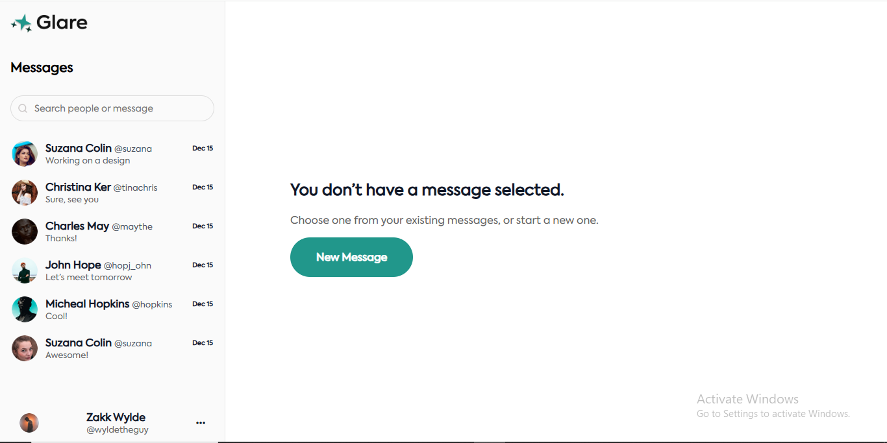
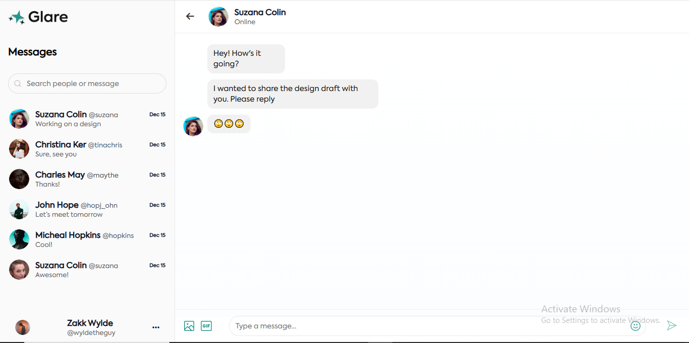

# Demo Chat App UI

This is a simple **demo chat app UI** showcasing a basic chat interface layout. It’s built to demonstrate a clean and responsive chat design with key components like a friend list, chat view, and message input.

## Features

- **Friend List** on the left side displaying friends.
- **New Message Button** (visible on desktop) that opens a modal to start a new chat.
- **Chat View** that opens when a friend is selected, showing the conversation.
- **Responsive Design**: On mobile screens, the new message button is hidden, and the chat view toggles with the friend list.
- **Message Input**: Allows typing and “sending” messages (demo only, no backend logic).

## How it works

- Clicking the **New Message** button opens a modal with a list of friends and a text input to type a message.
- Clicking **Send** in the modal currently does not perform any action (demo only).
- Clicking a friend in the friend list opens their chat view where you can type and send messages.
- On mobile, the UI adapts to show only the friend list or the chat view at a time for better usability.

## Tech Stack

- Built with **Vanilla JS** 
- Responsive CSS for desktop and mobile views

## Screenshots

---
